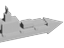
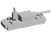
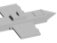

# THEATER — Contemporary Command

**A grounded, modern-warfare reimagining of Red Alert, evolving into a 4X-flavored RTS** — built as a mod on the [OpenRA](https://www.openra.net) engine.

> Real-time base-building and combat at its core, with the depth of a strategy game layered on top: real-country factions, a research tech tree, advancing eras, a strategic-resource economy, and gargantuan late-game "look-at-this-HUGE-thing" units.

This is a work in progress, developed in the open. Everything below is implemented and playable on the `theater` branch.

---

## What it is

THEATER takes Red Alert's fast RTS heartbeat and pulls it into the 2020s–2030s: instead of Allies vs. Soviets, you command contemporary national blocs (USA, Russia, China, Turkey, UK, India, + Japan/Germany), each with a distinct playstyle. Then it adds the depth that makes a session *last* — research, eras, economy decisions, and an apex tier of colossal units that are a real payoff for climbing the tech ladder.

It is **data-first**: nearly all of it is built on OpenRA's YAML trait system (no engine forks), so it stays compatible with the engine and is easy to read and extend.

## Highlights

- **8 contemporary factions** with asymmetric identities (precision air, heavy-armor brawl, drone mass, rapid mobility, intelligence/EW, layered standoff…), driven by doctrine modifiers rather than just stat swaps.
- **~38 custom 32-facing battlefield bodies** rendered in Blender — every aircraft, ship, and ground vehicle spawns as a bespoke modern unit, not a stock RA sprite.
- **Command layer**: buy-once **Fire Control** (army-wide targeting focus) and **Formations**, plus an always-on **Advanced Targeting** smart-default so units prioritize real threats over buildings.
- **Mid-game doctrine branches** — a mutually-exclusive identity fork per faction.
- A **4X progression layer** (see below).
- Classic Red Alert factions kept playable as legacy content; a **Sandbox/test map** for trying everything instantly.

## The 4X layer

A full progression/economy stack, all data-only:

| System | What it does |
|---|---|
| **Research Lab + tech tree** | A buildable lab unlocks a tree of accumulating army-wide upgrades (ballistics, armor, optics, propulsion, small arms, logistics) plus a **Mass-vs-Precision** decision fork. |
| **Ages / eras** | Advance **Modern → Information → Autonomous → Orbital**, each gated on the last and a real cost+time investment, each stacking a cumulative army-wide power bump — the lever for longer, escalating games. |
| **Strategic resource** | The **Alloy Extractor** drips income (so expansion pays) and produces `alloys`, which the apex tier requires — you can't top the ladder without strategic-resource infrastructure. |
| **Economy buildings** | A **Bank** (pure income, stackable), a **Fusion Reactor** (high-output power), and an **Economy Network** research that boosts all your income buildings. |
| **Apex spectacle units** | Four gargantuan, double-size units gated behind the Orbital age, each a distinct role. |

### The apex units

Rendered at 2× the size of everything else on the battlefield:

| | Unit | Role |
|---|---|---|
|  | **Leviathan** | Naval arsenal dreadnought — longest-reach naval guns, 500k HP |
|  | **Citadel** | Land mobile-fortress — direct-fire siege cannon + AA |
|  | **Archangel** | Air heavy gunship — sustained barrage (AA-vulnerable) |
|  | **Tempest** | Strategic rocket-artillery — map-wide saturation |

## Build & run

Requires the **.NET 8 SDK** plus the usual native libs (SDL2, OpenAL, FreeType, Lua 5.1).

```bash
make                       # build (Release) -> bin/
./theater-play.sh          # launch THEATER
./utility.sh theater --check-yaml   # validate mod data
```

The mod lives entirely under [`mods/theater/`](mods/theater) and mounts the stock Red Alert mod for shared assets.

## Design & docs

- [`design/theater-4x-evolution.md`](design/theater-4x-evolution.md) — the 4X north-star roadmap (what's done, what's next).
- [`design/contemporary-openra-design.md`](design/contemporary-openra-design.md) — the original design + fun-validation.
- [`design/art/render_aircraft_bodies.py`](design/art/render_aircraft_bodies.py) — the Blender pipeline for the custom 32-facing bodies.

## Status & roadmap

**Done:** the contemporary factions, doctrines, command layer, the custom battlefield-body roster, and the full data-only 4X stack (research → ages → strategic resource → four apex units → economy → a legible sidebar).

**Next (needs engine/C# or in-game tuning):** a true counted second resource with sidebar UI, light diplomacy, map objectives/secondary win conditions, and custom building bodies (footprint alignment needs in-game tuning).

## Credits & license

THEATER is a fork of [OpenRA](https://github.com/OpenRA/OpenRA) and is licensed under the **GPLv3**, same as the engine. OpenRA is © The OpenRA Developers and Contributors. See [`COPYING`](COPYING). THEATER mod content builds on Westwood's Red Alert assets via OpenRA's content system.
